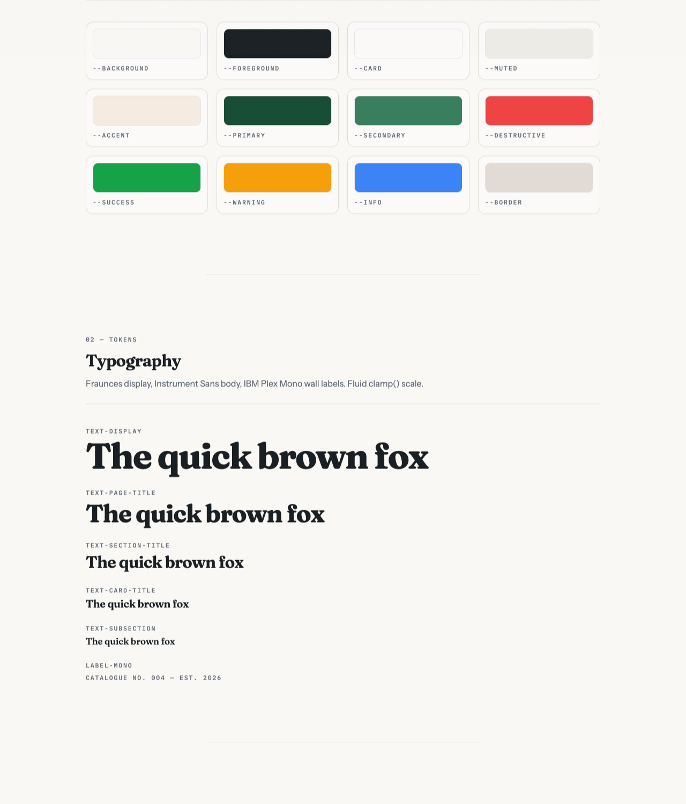

# ui

A shadcn registry at `https://ui.lscaturchio.xyz/r/<item>.json`. Install the
theme with `npx shadcn@latest add https://ui.lscaturchio.xyz/r/theme.json`
and any of ~70 components the same way; the CLI copies the source into your
app, so there is nothing to depend on at runtime.

The registry exists so my apps stop drifting apart visually. The `theme`
item (`registry/theme/identity.css` + `fonts.ts`) decides everything an app
should not be deciding for itself: warm paper background (`38 25% 97%`)
with a slate-night dark mode, forest-green primary (`152 52% 20%`),
Fraunces for display, Instrument Sans for body, IBM Plex Mono for the
uppercase "wall label" captions, hairline borders instead of shadows, a
fluid `clamp()` type scale, 150/200/300 ms motion durations, and a fixed
paper-grain overlay. An app gets exactly two knobs, `--primary` and
`--radius`; the ring colour and the whole radius scale derive from them.



## Use it

```bash
# the theme (tokens + fonts) — start here
npx shadcn@latest add https://ui.lscaturchio.xyz/r/theme.json

# then any components you want
npx shadcn@latest add https://ui.lscaturchio.xyz/r/button.json https://ui.lscaturchio.xyz/r/card.json
```

Wire it up:

```css
/* app/globals.css */
@import 'tailwindcss';
@import './identity.css';
```

```tsx
// app/layout.tsx
import { fontVariables } from "@/lib/fonts";
// <html className={fontVariables} suppressHydrationWarning>
```

## The rules

The paper, typography, and gallery language ARE the identity — do not
override them. Each app may set exactly two knobs, after the import:

```css
:root {
  --primary: 262 60% 35%;  /* your accent hue (hsl triplet) */
  --radius: 0.5rem;        /* corner personality */
}
```

`--ring` and the whole radius scale follow automatically.

## Items

| Category | Items |
|---|---|
| Theme | `theme` (identity.css + fonts.ts; add `@import 'tw-animate-css';` alongside) |
| Identity primitives | `button` `card` `badge` `accordion` `avatar` `section` `theme-toggle` `skeleton` |
| Patterns | `reveal` `active-nav-link` `breadcrumb-nav` `scroll-to-top` |
| Forms & inputs | `button-group` `calendar` `checkbox` `combobox` `field` `form` `input` `input-group` `input-otp` `label` `native-select` `radio-group` `select` `slider` `switch` `textarea` `toggle` `toggle-group` |
| Overlays | `alert-dialog` `command` `context-menu` `dialog` `drawer` `dropdown-menu` `hover-card` `menubar` `popover` `sheet` `sonner` `tooltip` |
| Navigation | `breadcrumb` `direction` `navigation-menu` `pagination` `sidebar` `tabs` |
| Data display | `aspect-ratio` `carousel` `chart` `empty` `item` `kbd` `marker` `table` |
| Feedback | `alert` `progress` `spinner` |
| Layout | `collapsible` `resizable` `scroll-area` `separator` |
| AI chat | `attachment` `bubble` `message` `message-scroller` |
| Hooks | `use-mobile` |

Upstream lists `toast` and `questionnaire` but publishes no installable item
for them (their own CLI 404s); they'll be added when upstream ships them.

## Develop

```bash
bun install
bun run dev            # gallery at localhost:3000
bun test               # unit + registry validation
bun run registry:build # rebuild public/r/*.json (commit the output)
bun run smoke          # end-to-end consumer test
```
